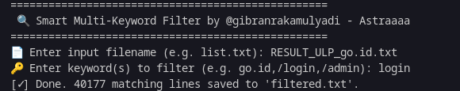

# 🔍 Smart Multi-Keyword Filter

A simple yet powerful Python script to filter lines from a file based on **multiple keywords**, such as domains, sensitive paths (`/login`, `/admin`), or specific strings.

### EXAMPLE


---

## 📌 Features

- 🎯 Filter using **multiple keywords** (comma-separated).
- 🧠 Case-insensitive matching.
- 📁 Automatically saves result to `filtered.txt`.
- ⚡ More flexible and faster than regular `grep`.

---

## 🚀 How to Use

### 1. Prepare your input file (e.g. `list.txt`)
Your file should contain entries like:
example.com:root:toor123  
webmail.go.id:admin:admin123  
admin.site.net:super:superpass  
login.example.go.id:root:bankpass  

### 2. Run the script

```bash
git clone https://github.com/00x0kafyy/ULP-filter.git
cd ULP-filter
python smart_filter.py
```

### 3. Enter Filename and Keywords to Filter

📄 Enter input filename (e.g. list.txt): list.txt
🔑 Enter keyword(s) to filter (e.g. go.id,/login,/admin): go.id,/login,/admin,webmail

### ✅ Output
```filtered.txt```


t.me/gibranrakamulyadi
